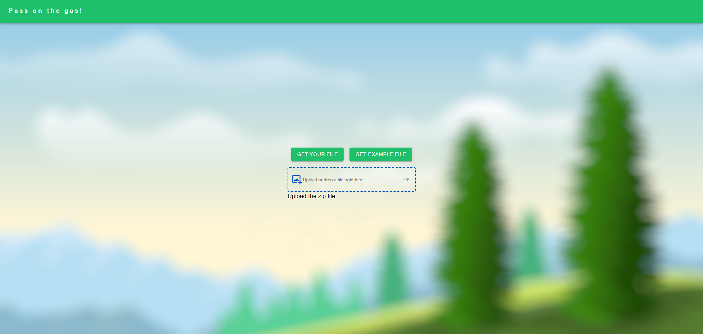
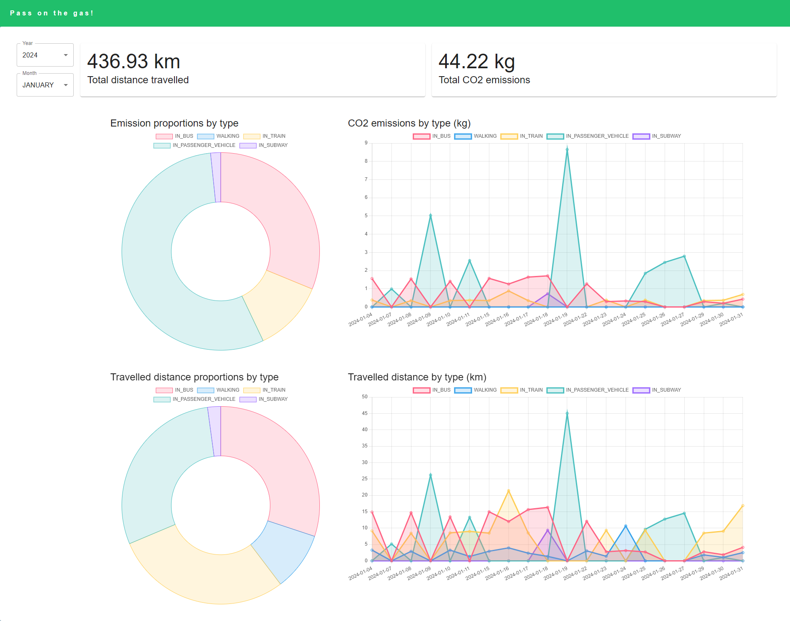

# Travel Carbon Footprint Tracker

A website to visualize your travel-related carbon footprint based on your location history from Google Maps.

Second place at [The Climate Change-Makers Challenge: 2022](https://devpost.com/software/pass-on-the-gas)

